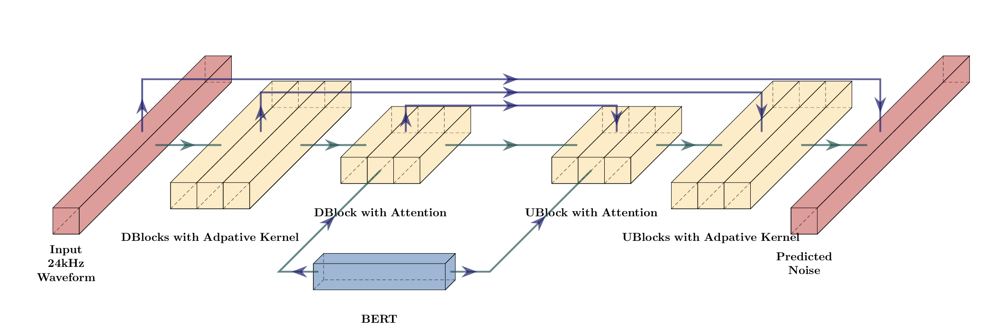

# Introduction
Over past years, I have been exploring about Text-to-Speech models, which takes plain text as input and generates audio waveform. There are a lot of models for converting plain text into speech. To understand how text is converted into speech, we need to understand how text and speech is represented.

There are different approach in which we can handle text and same goes for speech. For text, we can use text as raw input without any processing or can convert raw text into phonemes and then feed into the model. Module to convert text to phoneme can be helpful to embed different language specific pronunciation details. 

Audio data is represented in waveform format. Audio data can be represented in different forms. For working with TTS models, I have majorly dealt with audio waveform which represents audio in time dimension and Mel-Spectrogram which represents audio in frequency domain.

# Approach
For building TTS model, there are different approach. Models can be categorised based on the approach with which it is converting the text into speech. For example, early models first convert the text into Mel-Spectrogram. Then vocoder models are used to convert the Mel-Spectrogram to wavefrom, basically converting frequency domain data into time domain. Converting text into audio speech is sequence to sequence problem statement. With early models, there were different aspects for creating training data. TTS models were dependent on text to audio time-frames alignment data. Mapping of a text token/phoneme to the time frame which audio waveform/mel-spectrogram belongs. 

As we move along the time, in hope of building TTS models which could generate speech of high fidelity, which would capture complex nuances of mapping text tokens to audio frames End-to-End models were developed. These End-to-End models would just take plain text/phonemes as input and will generate audio wavefrom directly. It's architecture are designed as such, it will learn the alignment between text and audio frames while training process. Enough talking is done, let's deep dive into the model, which I am planning to create from scratch. It is different from above mention approach. It is based on diffusion model architecture along with text information coming from BERT model embedding.

# E3TTS
E3TTS is **E**asy **End**-to-**E**nd Diffusion based text to speech, a simple and efficient model. It takes plain text and generates an audio waveform through an iterative process of refinement. Unlike many TTS models, this does not rely on any intermediate representations like spectrogram features or alignment information. Instead E3TTS models the temporal structure of the waveform through the diffusion process. Without relying on additional conditioning information, E3 TTS could support flexible latent structure within the given audio. This enables E3 TTS to be easily adapted for zero-shot tasks such as editing without any additional training.


<center><i>UNet Structure: DBlock for downsampling block, UBlock for upsampling block</i></center>

To understand the building blocks of E3-TTS, we need to understand few concepts like Adaptive kernel for CNN layer, FiLM and Efficient UNet.


# Adaptive kernel
Standard convolution layer works with static kernel which is initialized at start of the training. As training progresses the weights of kernel are updated via backpropagtion.
Convolution layers came out to be very effective to capture the features of spatial data (images) or sequential data of large sequence (audio data). The behavour of static kernel tends to
be very rigid compared to dynamic kernels which are generated on the fly while training. Adaptive kernels have advantage over static kernels like:
1. **Context Sensitivity**: The model can change its processing strategy based on the speaker identity. For example, the filter used to generate a high-pitched child's voice should be different from one used for a deep baritone voice.
2. **Parameter Efficiency**: Instead of learning 100 different static filters to handle 100 different scenarios, you learn one small "generator" network that creates the right filter for the right moment.
3. **Temporal Precision**: In diffusion models (like E3TTS), the noise level changes at every step. Adaptive kernels allow the network to adjust its "denoising strength" precisely according to the time-step $t$, smoothing out noise aggressively in early steps and preserving fine details in later steps.

## Implementation
Adaptive kernel is used in E3TTS model conditioned with time and speaker embedding. Let's assume the embedding dimensions of time and speaker to be `128` and `256` respectively.

- Time embedding: $t \in \mathbb{R}^{128}$
- Speaker embedding: $s \in \mathbb{R}^{256}$
- Condition embedding: $c \in \mathbb{R}^{384}$

Condition embedding is created by concatenating the time and speaker embedding by last dimension
```python
condition = torch.cat([t, s], dim=-1)
```
To create adaptive kernels for convolution layer, we need to create `N` bank of kernel basis and `N` mixin-weights. For weights, we pass the condition vector `c` through affine network and softmax activation. This gives the weights which will be used to sum kernel basis. Kernel basis can be initialized with the shape of `(n_basis, out_channel, in_channel, kernel_size)`
```python
# Affine Network
affine_network = nn.Sequential(
    nn.Linear(time_embedding_dims + speaker_embedding_dims, n_basis),
    nn.Softmax(dim=-1)
)

# Basis Kernels
basis_kernels = nn.Parameter(
    torch.randn(n_basis, out_channels, in_channels, kernel_size)
)
```
Affine layer calculates the logits from condition vector. 
$$
weights = \text{Softmax}(w^T*c + b);\quad Where \;weights\in   [0, 1]^{n_{\text{basis}}} 
\\\
\text{basis\_kernels}\in\mathbb{R}^{n_{\text{basis}}\times\text{out\_channels}\times\text{in\_channels}\times\text{kernel\_size}}
$$
Based on these weights, basis kernels are summed to calculate the adaptive kernel which will be used to convolution layer.
```python
kernel = torch.einsum(
    'bn,noik->boik',
    weights,
    basis_kernels
)
```


